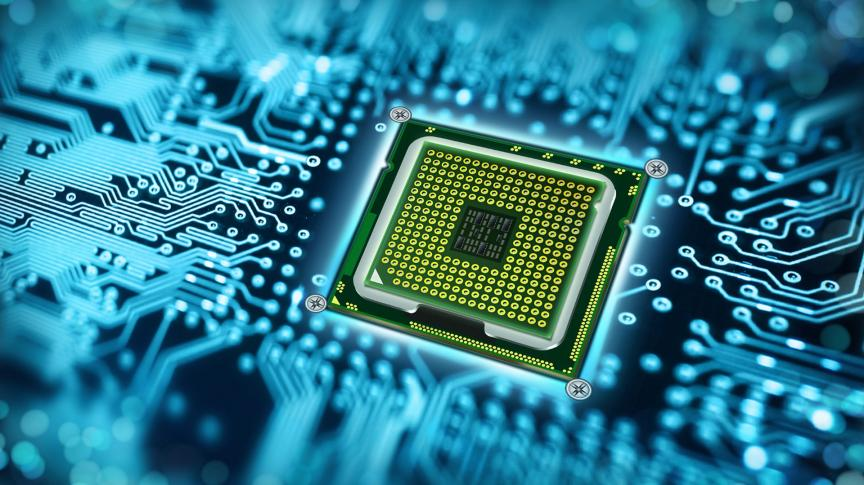

# Microprocessors-repo
<pre>
Microprocessors systems, Microprocessor Architecture.
The 8088/8086 microprocessor, the Instruction Set and assembly programming of the 8088/8086 family.
Interfacing 8088/8086 microprocessor/Microprocessors Lab with MML8086K3 Microprocessor trainer kit.
Using 8088/8086 Assembly Language with C/C++.

Each Directory Has:
   • The problem statement as a PDF file.
   • The solution.
</pre>

